# Proposta do Framework FARIA

Como estamos migrando do NXT para o EV3, com as principais diferenças sendo um processador ARM de 300 MHz com suporte para multithreads e um Linux embarcado, podemos aproveitar essas melhorias para criar um framework mais robusto e eficiente.

> FARIA é um acrônimo para Framework de Automação Robótica e Inteligência Artificial. (Patente pendente)

## Requisitos

1. Linguagem e Padrão: C++ 17/20, seguindo as melhores práticas de design de software e orientação a objetos.

2. Configuração Declarativa dos Robôs: Ao invés de fazer uma bagunça no Github com diferentes branches para cada configuração de robô, podemos adotar uma abordagem mais elegante. O FARIA terá um único código-fonte que deve servir para todos os robôs, e a configuração específica de cada robô (i.e. Nome, Sensores e Motores) é feita através de arquivos de configuração JSON.

3. Modularidade: Sensores e motores devem ser componentes plugáveis. Deve ser fácil adicionar um novo tipo de sensor, ou remover um motor de uma estratégia sem modificar o kernel do framework.

4. Multithreading abstraído: Separar a lógica em duas threads principais comunicando-se via um blackboard (buffer compartilhado). Isso evita condições de corrida e simplifica o código para quem não é tão nerd.  
    - Percepção: Leitura de sensores, processamento.  
    - Ação: Controle dos motores, estratégias  

5. Estratégias Selecionáveis: Antes da luta, o usuário poderá escolher, via interface gráfica no EV3, qual estratégia o robô deve executar. Essa escolha deve ser possível sem recompilar.

6. Interface Gráfica: O SDK do EV3 não possui suporte nativo para interfaces gráficas complexas, mas podemos criar uma lib própria que modifica o framebuffer do Linux para desenhar uma interface simples.

7. Ferramental: Scripts Python simples para compilar o código para o EV3 (usando a toolchain adequada) e fazer upload via USB/Bluetooth. Também podemos incluir uma lib local para logging e debug, que pode ser ativada ou desativada via configuração.

## Arquitetura Proposta

Arquitetura de camadas:

- Camada de Hardware: Abstração para sensores e motores (encapsulando as chamadas ao driver ev3dev ou à biblioteca C da LEGO, não sei ainda).
- Camada de Configuração: Leitura do arquivo de configuração e instanciação dinâmica dos componentes.
- Blackboard: Estrutura de dados compartilhada entre as threads (protegida por mutex). Armazena as últimas leituras dos sensores e os comandos de movimento.
- Thread de Percepção: Responsável por atualizar o blackboard com dados dos sensores.
- Thread de Ação: Responsável por ler o blackboard e, com base na estratégia escolhida, determinar os comandos para os motores (escrevendo de volta no blackboard).
- Interface Gráfica: Desenha menus na tela do EV3 (framebuffer) para seleção de estratégia.
- Estratégias: Classes que implementam uma interface comum (Strategy), com método execute(blackboard). Podem ser carregadas dinamicamente com base na escolha do usuário.

> Como podem ver é MUITO baseada nas frameworks do SPL kkkk

## Exemplo de Configuração em JSON

### JSON

```json
{
    "robot_name": "Asas",
    "sensors": [
        {"type": "ultrasonic", "port": "1", "alias": "ultrassom1"},
        {"type": "ultrasonic", "port": "2", "alias": "ultrassom2"},
        {"type": "color", "port": "3", "alias": "cor"}
    ],
    "motors": [
        {"type": "large", "port": "A", "alias": "motorEsquerdo"},
        {"type": "large", "port": "B", "alias": "motorDireito"}
    ],
    "strategies": [
        {"name": "AgressivoMaluco", "class": "AgressivoMalucoStrategy"},
        {"name": "ViraMortal", "class": "ViraMortalStrategy"}
    ]
}
```

### Diagramas de Classes Simplificado



## Implementação

### Hardware Abstraction Layer (HAL)

Utilizaresmo a lib `ev3dev-lang-cpp` (ou uma similar) para acessar sensores e motores. Exemplo de uma classe base `Sensor`:

```cpp
class Sensor {
public:
    virtual ~Sensor() = default;
    virtual int read() = 0;
};

class Ultrassom : public Sensor {
    ev3dev::ultrasonic_sensor sensor;
public:
    Ultrassom(std::string port) : sensor(port) {}
    int read() override { return sensor.distance_centimeters(); }
};
```

### Configuração Declarativa

Podemos usar uma lib como `nlohmann/json` para ler o JSON de configuração. Exemplo de leitura do JSON:

```cpp
void Robot::loadConfig(const std::string& filename) {
    std::ifstream f(filename);
    json config = json::parse(f);
    robotName = config["robot_name"];
    
    for (auto& s : config["sensors"]) {
        std::string type = s["type"];
        std::string port = s["port"];
        std::string alias = s["alias"];
        
        if (type == "ultrassom")
            sensors.push_back(std::make_unique<Ultrassom>(port));
        else if (type == "toque")
            sensors.push_back(std::make_unique<Toque>(port));
        // ...
        sensors.back()->alias = alias;

    }
    
    // similar para motores e estratégias
}
```

### Multithreading e Blackboard

O blackboard será uma classe com um `std::map` (hashmap) para os valores de sensores indexados por alias (apelido), protegido por um `std::mutex` para evitar condições de corrida. Exemplo:

```cpp
class Blackboard {
    std::map<std::string, int> sensorValues;
    std::map<std::string, int> motorSpeeds;
    std::mutex mtx;
public:
    void updateSensor(const std::string& alias, int value) {
        std::lock_guard<std::mutex> lock(mtx);
        sensorValues[alias] = value;
    }
    
    int getSensor(const std::string& alias) {
        std::lock_guard<std::mutex> lock(mtx);
        return sensorValues[alias];
    }
    
    void setMotor(const std::string& alias, int speed) {
        std::lock_guard<std::mutex> lock(mtx);
        motorSpeeds[alias] = speed;
    }
    
    int getMotor(const std::string& alias) {
        std::lock_guard<std::mutex> lock(mtx);
        return motorSpeeds[alias];
    }
};
```

Na classe `Robot`, criaremos duas funções que rodarão em threads separadas: `perceptionLoop()` e `actionLoop()`. A `perceptionLoop()` ficará lendo os sensores e atualizando o blackboard, enquanto a `actionLoop()` ficará lendo o blackboard e executando a estratégia escolhida:

```cpp
void Robot::perceptionLoop() {
    while (running) {
        for (auto& sensor : sensors) {
            int value = sensor->read();
            blackboard.updateSensor(sensor->alias, value);
        }
        std::this_thread::sleep_for(10ms); // taxa de amostragem
    }
}

void Robot::actionLoop() {
    while (running) {
        // Lógica da estratégia atual
        if (currentStrategy) {
            currentStrategy->execute(blackboard);
        }
        
        // Manda comandos para os motores
        for (auto& motor : motors) {
            int speed = blackboard.getMotor(motor->alias);
            motor->setSpeed(speed);
        }
        std::this_thread::sleep_for(10ms);
    }
}
```

No `main()`, após carregar a configuração e escolher a estratégia, basta iniciar as threads com `std::thread`.

### Estratégias

Definiremos uma interface `Strategy` que todas as estratégias devem implementar:

```cpp
class Strategy {
public:
    virtual ~Strategy() = default;
    virtual void execute(Blackboard& bb) = 0;
};

class AgressiveStrategy : public Strategy {
    void execute(Blackboard& bb) override {
        int dist = bb.getSensor("frente");
        if (dist < 20) {
            bb.setMotor("esquerda", 50);
            bb.setMotor("direita", 50);
        } else {
            bb.setMotor("esquerda", 30);
            bb.setMotor("direita", -30);
        }
    }
};
```

A seleção da estratégia pode ser feita via um mapa de strings para funções criadoras (`std::map<std::string, std::function<std::unique_ptr<Strategy>()>>`). A interface gráfica preencherá a escolha.

## Interface Gráfica

O EV3 roda Linux e disponibiliza o framebuffer do display em `/dev/fb0`. Para simplificar, usaremos uma biblioteca leve como SDL2 (compilada para EV3) ou uma implementação própria de desenho de texto e retângulos.

> O framebuffer é basicamente um mapa na memória que representa os pixels da tela. Para desenhar algo, basta escrever os valores de cor nos endereços correspondentes. Então mudar o valor `framebuffer[10][10]` para `0xFFFFFF` (branco) desenharia um pixel branco na posição (10, 10) do display.

Uma ideia: criar um menu simples com setas e botão central do EV3 para navegar entre as estratégias listadas no config. O código pode usar `ev3dev::button` para capturar os botões.

Exemplo:

```cpp
void selectStrategy() {
    std::vector<std::string> strategies = {"Porradeiro", "MortalPraTrás", "ProcuraEDescePorrada"};
    int choice = 0;
    while (true) {
        desenharMenu(strategies, choice);
        if (button::enter.pressed()) break;
        if (button::up.pressed()) choice = (choice - 1 + strategies.size()) % strategies.size();
        if (button::down.pressed()) choice = (choice + 1) % strategies.size();
        delay(100);
    }
    return strategies[choice];
}
```

## Ferramental

Usaremos scripts Python para automatizar o processo:

- Compilação: Chamar o `arm-linux-gnueabi-g++` (ou o cross-compiler da ev3dev) com os flags necessários. O script pode montar uma árvore de build, copiar bibliotecas estáticas, etc.
- Upload: Usar `scp` para copiar o binário para o EV3 via USB (atualmente com IP dinâmico) ou via Bluetooth (usando rfcomm talvez). O script pode também reiniciar o robô remotamente via ssh.

Exemplo de `build.py`:

```python
import subprocess, sys

def build():
    cmd = "arm-linux-gnueabi-g++ -std=c++17 src/*.cpp -o bin/robot -Iinclude -lpthread"
    subprocess.run(cmd, shell=True)

def upload():
    subprocess.run("scp bin/robot robot@192.168.10.1:/home/robot/", shell=True)
    subprocess.run("ssh robot@192.168.10.1 'chmod +x /home/robot/robot'", shell=True)

if __name__ == "__main__":
    if sys.argv[1] == "build": build()
    elif sys.argv[1] == "upload": upload()
```

## Organização do Repositório

```txt
/FARIA_Framework/
    ├── configs/            # arquivos de configuração para cada robô
    ├── include/            # headers públicos
    ├── src/                # código fonte (.cpp)
    ├── strategies/         # implementações de estratégias 
    ├── scripts/            # scripts python
    ├── lib/                # bibliotecas externas (ev3dev-cpp, nlohmann/json)
    └── Makefile ou CMakeLists.txt
```

## Créditos

- Inspirado nas frameworks do Falecido SPL e em boas práticas de design de software.
- Autor: [Lucas Chaves](https://github.com/LucasVChaves)
